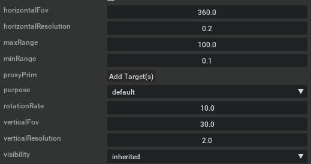

# isaac_sim_pointcloud_tool
This package converts pointcloud in Isaac Sim to velodyne format. This is a ROS package. It subscribes to the LiDAR rostopic which is published by Isaac Sim. And it republish a LiDAR rostopoic in Velodyne format.

Some SLAM algorithm needs pointcloud in Velodyne format so that it can extract corner points. But Isaac ROS only send pointcloud contains XYZ information. This package helps to convert pointcloud to velodyne format.

This is my lidar config in Isaac Sim. (VLP-16)

Lidar config

Before  

After  

Successfully run LVI-SAM  

