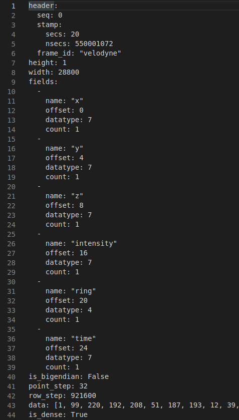
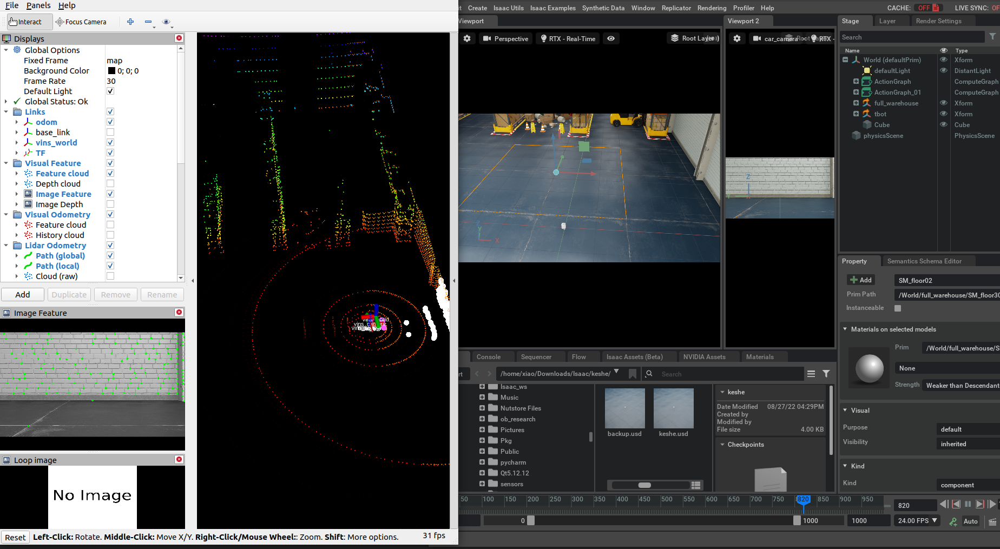

# isaac_sim_pointcloud_tool
This package converts pointcloud in Isaac Sim to velodyne format.   
Some SLAM algorithm needs pointcloud in Velodyne format so that it can extract corner points. But Isaac ROS only send pointcloud contains XYZ information. This package helps to convert pointcloud to velodyne format.

Before

After

Successfully run LVI-SAM

